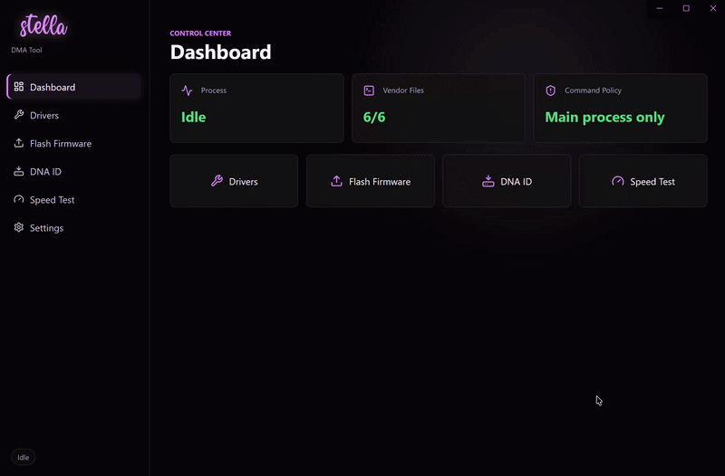

# Stella DMA Tool

  <b>All-in-one Windows utility for DMA hardware</b> 
  Flash firmware, read DNA ID, install drivers, and run PCILeech diagnostics — all from a clean interface.

  
  
  
  

---

## 🚀 Overview

Stella DMA Tool simplifies DMA workflows into a single desktop application.

No more manual scripts or scattered tools — everything is handled through a streamlined UI with real-time logs and guided actions.

---

## ✨ Features

- 🔌 **Driver Installation**
  - CH347 & RS232 support
  - One-click install

- ⚡ **Firmware Flashing**
  - OpenOCD-based flashing
  - Supports 35T / 75T / 100T boards

- 🧬 **DNA ID Reader**
  - Fast hardware identification
  - Copy-ready output

- 📊 **PCILeech Speed Test**
  - Benchmark + read tests
  - Averaged results displayed

- 🔄 **Auto Updates**
  - Built-in updater
  - Seamless install & restart

---

## 🖼️ Showcase

---

## 📦 Installation

1. Go to Releases:  
   👉 https://github.com/00micxh794/stella-dma-tool-releases/releases  

2. Download: Stella-DMA-Tool-x.x.x-Setup.exe

3. Run the installer

---

## ⚙️ Usage

1. Install the correct driver (CH347 / RS232)
2. Select your board:
- 35T
- 75T
- 100T
3. Use:
- Flash Firmware
- Read DNA ID
- Speed Test

All actions include live logs.

---

## 🔄 Updates

- App checks for updates automatically
- Notifies you when a new version is available
- Updates install seamlessly from within the app

---

## 👨‍💻 Developer

- **Discord:** `@00micxh`  
- **Signal:** `micxhx.11`

---

## 🐞 Feedback

Found a bug or issue?  
Reach out via Discord or Signal.

---

## 📄 License

MIT License
